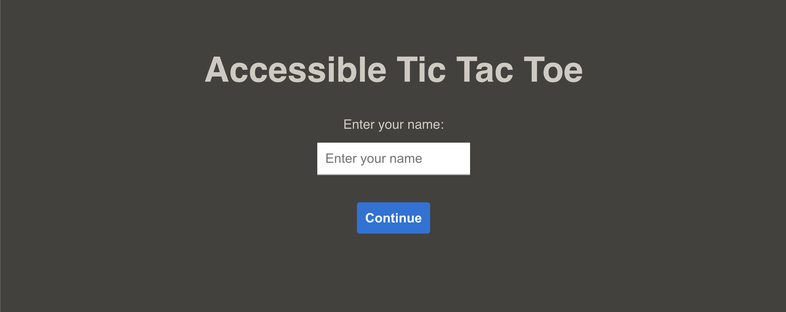

# Accessible Tictactoe

Accessible Tictactoe is a multiplayer platform game that provides accessibility for persons-with-disabilities.

## Setup Instructions

Clone down this repository. You will need `node` and `npm` installed globally on your machine.

### Client Side

Switch to Client Side (frontend) Directory:

`cd frontend`

Installation:

`npm install`

To Start Client:

`npm start`

To Visit App:

`localhost:3000/`

You should see something like this:

### Server Side

Switch to Server Side (backend) Directory:

`cd backend`

Installation:

`npm install`

To Start Server:

`npm start`

You should see something like this:

## Design Decisions

### Usage of Socket.IO

When coming up with the hierarchical design of this project, I was debating between the use of Socket.IO and Google Firebase's backend service. I eventually decided to use Socket.IO because of two reasons. Firstly, upon doing my research, Socket.IO is built for real-time bidirectional communication between client and server, so in a sense it is very well suited for real-time applications such as this one. Secondly, I have not used Socket.IO before, so I was intrigued to pick up this new technology. However, I do admit that Firebase's persistent data storage would definitely be an very helpful in enhancing this project (Storing past games) but I will leave that to a future iteration.

### Screenreader Accessibility

By adding aria labels (and roles) to HTML elements, screenreader devices are able to narrate over the elements of the webpage. Here's a demonstration:

https://user-images.githubusercontent.com/83890525/218776005-86b5b99b-a1ba-4eb5-999c-a4987f4c3778.mp4

### Colour Contrast

By ensuring that the contrast ratio between text and background is high enough, allows texts to be read more easily.

## Plans for Future Iterations

1. Fully implement keyboard accessibility. As of right now, the tictactoe multiplayer game is not fully keyboard-integrated. In the near future, I will continue attempting to fully integrate the keyboard accessibilty into the webpage (especially for the gameplay).

2. Implement a 'match history'. As of right now, sign-ins are anonymous, and there is no means to store the past games played. In the near future, I will try using Google Firebase's database API to store credentials and player information (such as match history).

## Author

[kavantan](https://github.com/kavantan)
